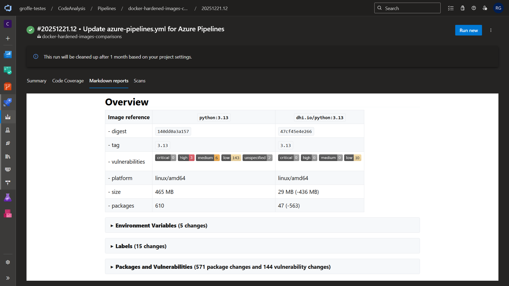
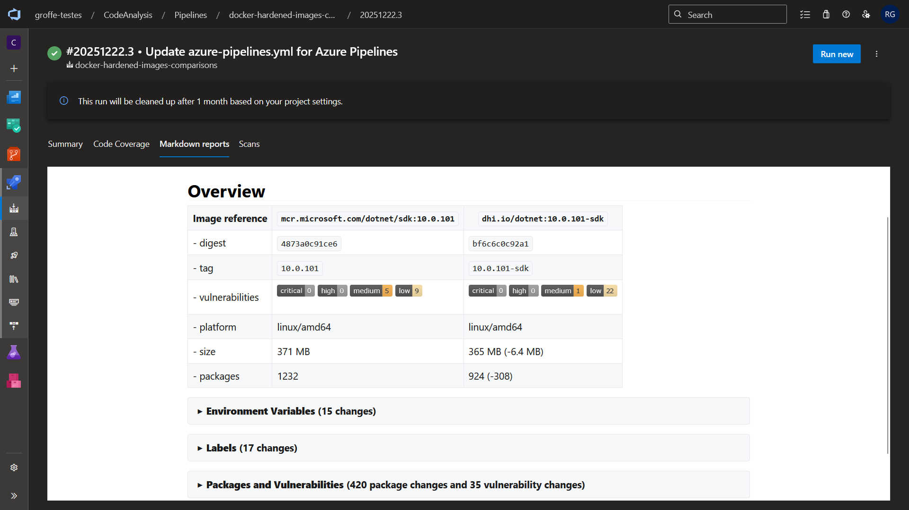
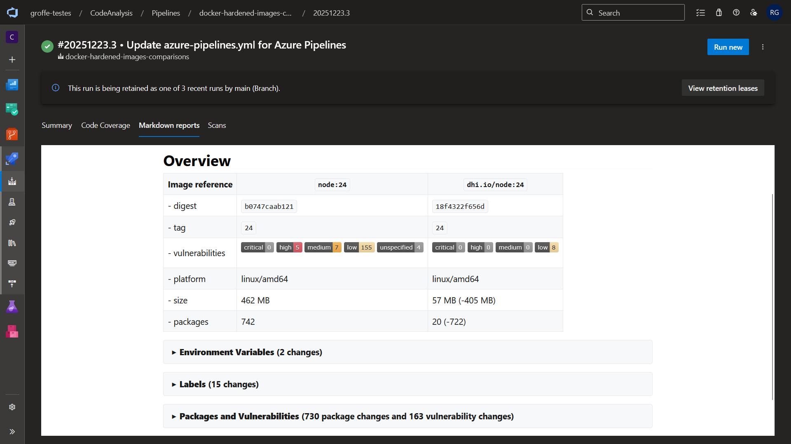

# azuredevops-docker-hardened-images-comparisons
Pipeline do Azure DevOps para testes comparando a segurança de imagens convencionais e Docker Hardened Images (DHI) via utilitário docker scout.

---

## Testes | Tests

Exemplo de execuçao do pipeline com imagens do **Python 3.13**:

*Example of pipeline execution with images from Python 3.13:*

Exemplo de execuçao do pipeline com imagens do **.NET 10**:

*Example of pipeline execution with .NET 10 images:*

Exemplo de execuçao do pipeline com imagens do **Node 24**:

*Example of pipeline execution using Node.24 images:*

Exemplo de execuçao do pipeline com imagens do **Go 1.24**:

*Example of pipeline execution with Go 1.24 images:*